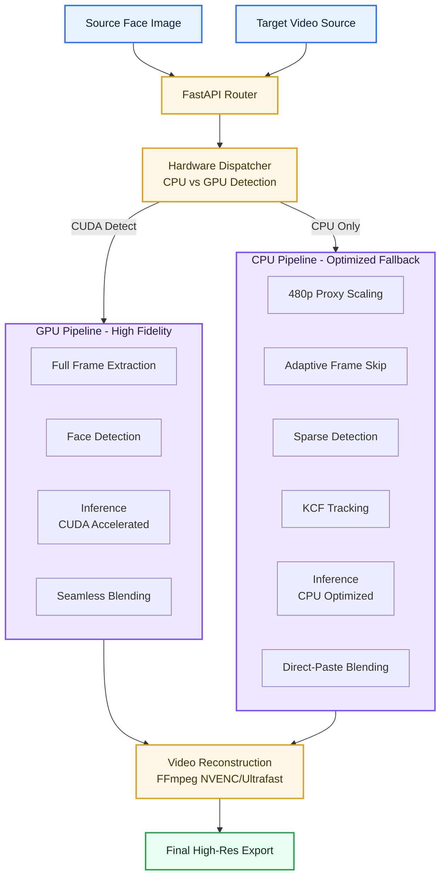

<div align="center">
  
  
  # 🎭 PersonaForge AI
  **The ultimate production-grade video face transformation engine.**

  [](https://www.python.org/)
  [](https://developer.nvidia.com/cuda-zone)
  [](https://fastapi.tiangolo.com/)
  [](https://opensource.org/licenses/MIT)
</div>

---

## 🚀 Project Vision
**PersonaForge AI** is a high-performance face-swapping platform engineered for production-grade results across diverse hardware profiles. Unlike traditional tools that strictly require high-end workstations, PersonaForge features an **Intelligent Hardware-Aware Dispatcher** that dynamically optimizes its processing logic between high-fidelity GPU paths and efficient CPU fallbacks.

It bridges the gap between AI research and practical application by offering zero-compromise final renders and high-speed, low-latency previews.

---

## 🎬 Transformation Showcase
*See the seamless identity transfer in action with varying lighting and facial orientations.*

### 🎭 Video Demonstrations (GIFs)
| Cinematic Examples | Motion Stability |
|:---:|:---:|
|  |  |
| *High-Fidelity Rendering* | *KCF Tracking in Action* |

### 🖼️ Result Analysis (Before & After)
| Source & Target | Transformation Result |
|:---:|:---:|
|  |  |
| *Input Mapping Collage* | *Integrated Identity Result* |

> [!TIP]
> Use the **Preview Mode** to generate low-latency GIF previews in seconds to validate your character mapping before committing to a full-resolution render.

---

## ✨ Advanced Features

### 🧠 Core AI Engine
- **InsightFace Integration:** Leveraging state-of-the-art ONNX models for high-fidelity facial identity transfer.
- **Hybrid Blending Architecture:** Professional-grade **Poisson (SeamlessClone)** blending for GPU depth and **Alpha-Compositing** for CPU speed.
- **Identity Normalization:** Advanced color-space pass ensuring consistent facial features under varying ambient light.

### ⚡ Performance Engineering
- **Hardware-Aware Dispatcher:** Intelligent routing that switches entire processing kernels—not just the backend—based on available CUDA providers.
- **Temporal Bridge (KCF):** Uses **Kernelized Correlation Filters** to maintain facial stability across frames, reducing heavy AI detection passes by up to 90%.
- **Adaptive Frame Skip:** Intelligent 1-in-N processing for rapid CPU previewing without sacrificing scene context.

### 🎨 Workflow & UX
- **Zero-Latency Previews:** Rapid preview generator for immediate feedback on face-swap accuracy.
- **Modular Config Profiles:** Discrete tuning constants for CPU/GPU paths ensure rock-solid stability even on low-spec hardware.
- **RESTful API Core:** A clean, documented FastAPI backend designed for easy integration into existing creative pipelines.

---

## 🧠 Technical Architecture
The system utilizes a modular decoupled pattern, separating the **Inference Brain** from the **Hardware Logic**.



---

## 📊 Performance Benchmarks
*Tested with a 10-second 720p @ 30fps source video.*

| Hardware Environment | Pipeline Mode | Render Time | Efficiency Index |
|:---:|:---:|:---:|:---:|
| **NVIDIA RTX 3080** | Full GPU Path | ~42 sec | 🔥 Baseline (1.0x) |
| **Intel Core i7-11800H** | Optimized CPU (Fast) | ~115 sec | 💎 2.7x vs. Raw CPU |
| **Apple M1 Air** | Optimized CPU (Balanced) | ~140 sec | ❄️ Thermal Optimized |

---

## 📦 Installation & Setup

### 1. Environment Preparation
It is recommended to use **Conda** for isolated environment management:

```bash
# Create and activate environment
conda env create -f environment.yml
conda activate personaforge
```

Or via **pip** (Python 3.10+):
```bash
python -m venv .venv
# On Windows
.venv\Scripts\activate
# On Linux/MacOS
source .venv/bin/activate
pip install -r requirements.txt
```

### 2. Model Initialization
PersonaForge requires pre-trained ONNX models. Use the automated setup utility to validate and download required assets:

```bash
python scripts/setup_models.py
```
*Alternatively, place `inswapper_128.onnx` manually in the `models/` directory.*

### 3. Launching the App
```bash
# Start the FastAPI server
python main.py
```
*Access the dashboard at `http://127.0.0.1:8000`*

---

## 📁 System Structure
```text
PersonaForge/
├── main.py                    # Entry point & API Logic
├── face_swap.py               # Dispatcher & Engine
├── video_utils.py             # FFmpeg/OpenCV Media Engine
├── config/                    # Tuning Constants
├── models/                    # Validated ONNX Assets
├── pipelines/                 # Hardware-Specific Loops
└── utils/                     # Tracking & Tracker Factories
```

---

## 👤 Author
**Himanshu Jadhav**

[](https://github.com/himanshu-jadhav108)
[](https://www.linkedin.com/in/himanshu-jadhav-328082339)
[](https://www.instagram.com/himanshu_jadhav_108)
[](https://himanshu-jadhav-portfolio.vercel.app/)

---
*Disclaimer: This project is intended for educational and creative use. Users must adhere to ethical standards regarding consent and privacy.*