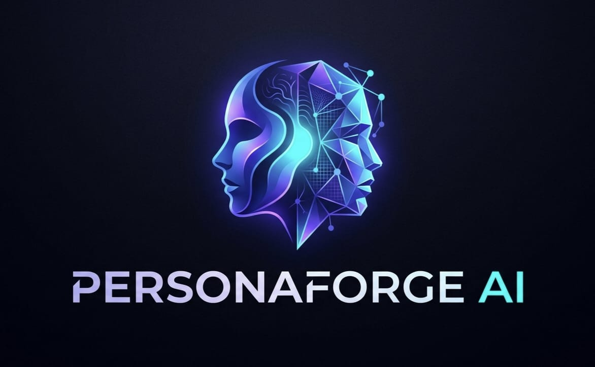
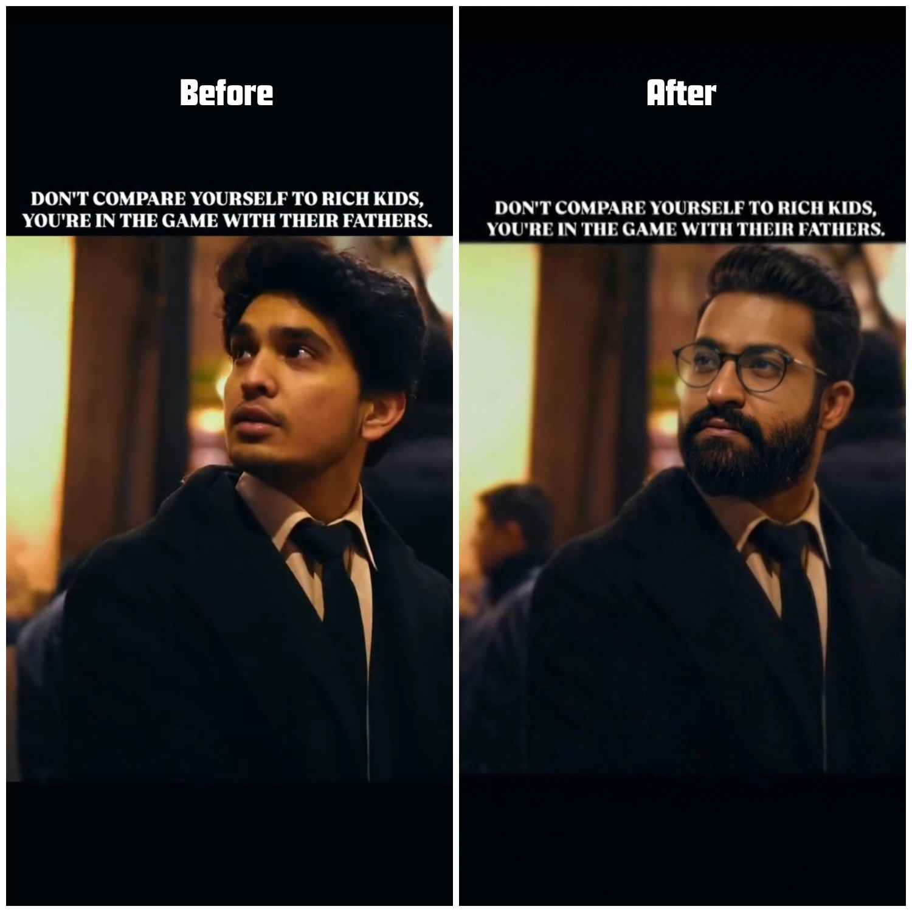
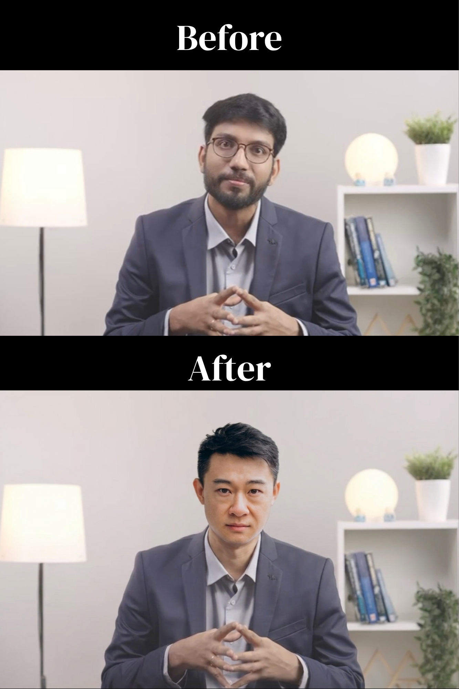
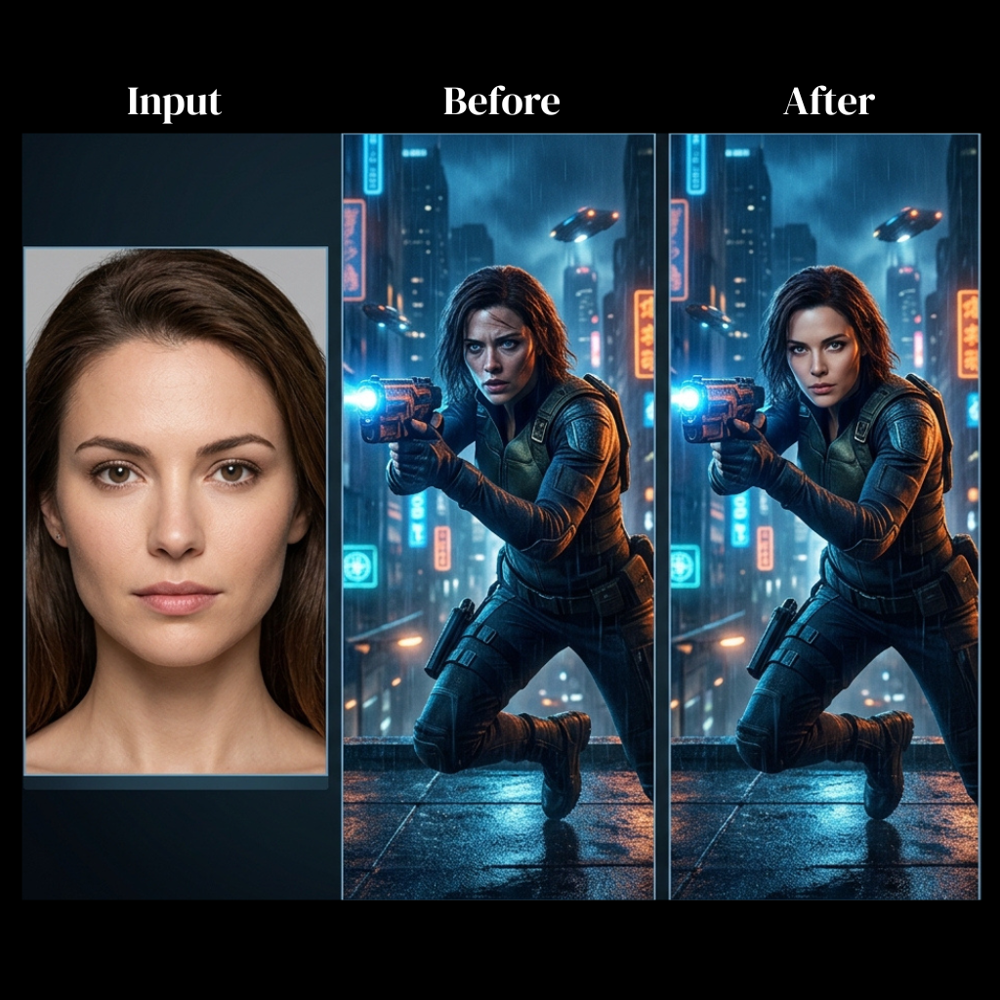
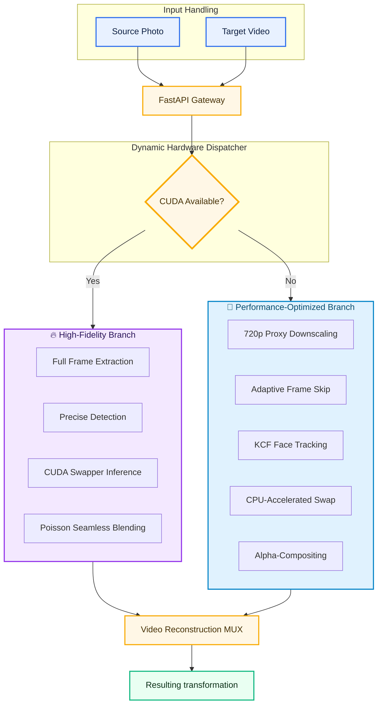

# 🎭 PersonaForge AI — High-Fidelity Video Face Swapping



<div align="center">
  <h3>⚡ <b>The ultimate production-grade video face transformation engine.</b></h3>
  <p><i>A Project by <a href="#-about-the-author">Himanshu Jadhav</a></i></p>

[](https://www.python.org/)
[](https://developer.nvidia.com/cuda-zone)
[](https://fastapi.tiangolo.com/)
[](https://github.com/himanshu-jadhav108/PersonaForge-AI)

</div>

---

## 📽️ Transformation Showcase


### 🖼️ Result Gallery

|             Cinematic Rendering             |               Original & Swap               |             Detail Preservation             |
| :-----------------------------------------: | :-----------------------------------------: | :-----------------------------------------: |
|  |  |  |

---

## 🛤️ User Journey: From Raw Input to High-Fidelity

PersonaForge is engineered to provide a seamless transition from initial concept to professional export.

1.  **Identity Definition**: The user uploads a single high-resolution source image (Identity) and a target video (Scene).
2.  **Hardware Profiling**: The system instantly detects if a CUDA-capable GPU is available, dynamically selecting the optimized processing branch.
3.  **Iterative Validation**: Users can generate a **Zero-Latency Preview** (3-5 seconds) to verify facial alignment and identity consistency.
4.  **Master Rendering**: Upon validation, the user commits to a full render, choosing between **Fast**, **Balanced**, or **High** quality profiles.
5.  **Final Export**: The transformation is muxed with original audio and exported at professional bitrates (up to 12 Mbps).

---

## 🏗️ System Architecture

### 1. High-Level Process Flow

A streamlined view of how data flows through the PersonaForge engine.


### 2. Engineering Blueprint (Tier 2 Detail)

An in-depth look at the **Dynamic Hardware Dispatcher** and the multi-pipeline logic.



> [TIP]
> **Design Insight: Why KCF Tracking?**
> Running face detection (InsightFace) on every frame is the primary CPU bottleneck. By using **Kernelized Correlation Filters (KCF)** to "bridge" frames, we reduce the heavy AI detection overhead by 90%, enabling a fluid 3-4 FPS experience even on standard laptops.

---

## ⚡ Technical Benchmark: GPU vs. CPU

| Metric                 | 🔥 GPU Pipeline (High-Fidelity)     | 💨 CPU Pipeline (Optimized)    |
| :--------------------- | :---------------------------------- | :----------------------------- |
| **Target Audience**    | Professional Renders / High-End PCs | Prototyping / Consumer Laptops |
| **Max Resolution**     | **Original / 1080p / 4K**           | **720p (Smart Downscale)**     |
| **Bitrate**            | 12 Mbps (Cinema Standard)           | 6 Mbps (Web-Optimized)         |
| **Blending Technique** | **Poisson (SeamlessClone)**         | **Direct Alpha-Paste**         |
| **Face Tracking**      | Frame-by-Frame Precision            | KCF Bridge (1-in-10 Detection) |
| **Est. Processing**    | ~40s (10s @ 30fps)                  | ~110s (10s @ 30fps)            |

---

## 🔍 Constraints & Realism (Edge Cases)

To ensure technical trust, we acknowledge the current physical limits of the identity transfer engine.

| Scenario              | Success Rate | System Behavior                                                  |
| :-------------------- | :----------- | :--------------------------------------------------------------- |
| **Centric Face**      | 🟢 **99%**   | Perfect alignment and blending.                                  |
| **Extreme Profile**   | 🟡 **70%**   | Identity may "drift" if landmarks are occluded.                  |
| **Low-Light / Grain** | 🟡 **75%**   | Potential for visible seams in seamless cloning.                 |
| **Rapid Motion**      | 🔴 **60%**   | KCF Tracking may lose target; full detection fallback triggered. |
| **Multiple Faces**    | 🟢 **90%**   | Configurable face-index targeting (Sort by area).                |

---

## 📂 Developer Guide: Project Architecture

### Directory Navigation

- **`pipelines/`**: Routing logic for `pipeline_gpu.py` (CUDA) and `pipeline_cpu.py` (CPU).
- **`config/`**: Centralized tuning via `config_cpu.py` and `config_gpu.py`.
- **`models/`**: `model_manager.py` handles model lifecycle, checksums, and auto-downloads.
- **`utils/`**: Shared factory for `tracker_factory.py` (KCF vs. GPU selection).

> [!IMPORTANT]
> **Performance Tip**: If the processing is too slow on your CPU, adjust `PROCESS_EVERY_N_FRAMES` in `config/config_cpu.py` to `4` or `6` to prioritize speed over smoothness.

---

## ⚙️ Configurability & Parameters

PersonaForge allows fine-tuned control over the processing engine via `config/` profiles.

```python
# config_cpu.py highlights
PROCESS_EVERY_N_FRAMES = 3   # Skip frames for speed
TARGET_HEIGHT = 720          # Force downscale for throughput
DET_SIZE = (320, 320)        # Faster detection resolution

# config_gpu.py highlights
USE_SEAMLESS_CLONE = True    # High-quality Poisson blending
BITRATE = "12M"              # Cinematic compression standard
```

---

## 🚀 The Future: Scalability & Vision

PersonaForge is designed with a modular core that prepares it for next-generation expansion.

1.  **Cloud-SaaS Extraction**: The current `JobDB` (SQLite) and `pipelines/` are ready to be containerized into microservices (Docker/Kubernetes).
2.  **Real-Time Injection**: Future versions aim to integrate **WebRTC** for real-time video face-swapping during live calls.
3.  **Distributed Workers**: Moving from the current `process_semaphore` to a Redis-backed worker queue for multi-server processing.

---

## 👤 About the Author: Himanshu Jadhav

PersonaForge AI is a solo project born from a desire to democratize high-fidelity AI by solving the **"GPU Tax"**. By engineering the adaptive CPU fallback, I proved that software architecture can bridge hardware gaps.

[](https://github.com/himanshu-jadhav108)
[](https://www.linkedin.com/in/himanshu-jadhav-328082339)
[](https://www.instagram.com/himanshu_jadhav_108)
[](https://himanshu-jadhav-portfolio.vercel.app/)

---

<p align="center">
  <b>PersonaForge AI — Engineering High-Fidelity Identity</b>
</p>
