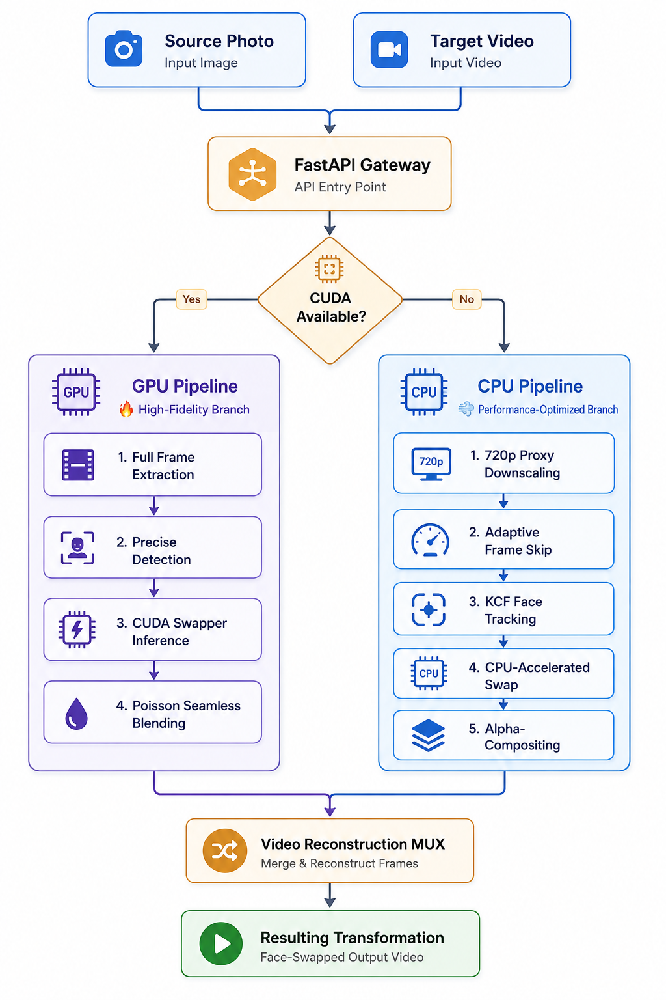
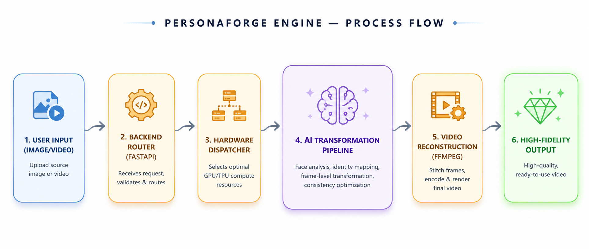

# 🎭 PersonaForge AI — High-Fidelity Video Face Swapping


<div align="center">
  <h3>⚡ <b>The ultimate privacy-focused local video face transformation engine.</b></h3>
  <p><i>Privacy-First. GPU-Accelerated. 100% Local.</i></p>

[](https://www.python.org/)
[](https://developer.nvidia.com/cuda-zone)
[](https://fastapi.tiangolo.com/)
[](https://github.com/himanshu-jadhav108/PersonaForge-AI)
[](LICENSE)


</div>

---

## 📌 Table of Contents
1. [📖 Overview](#-overview)
2. [✨ Core Features](#-core-features)
3. [🚀 Getting Started](#-getting-started)
4. [📽️ Transformation Showcase](#%EF%B8%8F-transformation-showcase)
5. [🏗️ System Architecture](#%EF%B8%8F-system-architecture)
6. [📊 Technical Benchmark: GPU vs. CPU](#-technical-benchmark-gpu-vs-cpu)
7. [🔍 Validation & Realism Constraints](#-validation--realism-constraints)
8. [🎛️ Slide Presentation Generator](#%EF%B8%8F-slide-presentation-generator)
9. [📁 Project Architecture](#-project-architecture)
10. [⚙️ Tuning Configurations](#%EF%B8%8F-tuning-configurations)
11. [👤 About the Author](#-about-the-author)

---

## 📖 Overview

PersonaForge AI is an advanced computer vision engineering project designed to run high-fidelity face transformations entirely on local consumer hardware. By decoupling heavy AI dependencies and implementing a robust Hardware Abstraction Layer, the system dynamically schedules execution between GPU (CUDA-accelerated) and CPU branches. 

This project is built for AI engineers, recruiters, and open-source contributors looking to explore high-throughput local inference pipelines without relying on external cloud APIs or exposing private media files.

---

## ✨ Core Features

- 🔒 **Privacy-First Operations**: 100% offline. Zero tracking pixels, zero API calls, and zero external cloud uploads.
- ⚙️ **Hardware-Aware Execution**: A custom initialization engine that detects local environment bindings and dynamically routes frame arrays to CUDA execution providers or CPU fallbacks.
- ⚡ **In-Memory Streaming (RAM I/O)**: Bypasses standard disk-writing bottleneck loops by buffering frames in RAM and piping them directly to FFmpeg stdin via standard stream buffers.
- 📈 **Facial Identity Consistency**: Automatically computes the Cosine Similarity between the source identity embedding and every processed target frame face node to log identity drift statistics.
- 💨 **Kernelized Correlation Filter (KCF) Tracking**: Reduces expensive facial detection calls (InsightFace inference loops) by 90% by using adaptive KCF tracking blocks on intermediate frames.

---

## 🚀 Getting Started

To install dependencies, download model weights, set up the FastAPI server, run the Streamlit dashboard, or profile execution providers, please refer to our step-by-step [PersonaForge AI Getting Started Guide](docs/guide.md).

---

## 📽️ Transformation Showcase

Here is a demo loop showing the input and high-fidelity output alignment:


---

## 🏗️ System Architecture

### 1. System Architecture Blueprint
The application is structured into decoupled frontend presentation, API gateway, and model runtime layers.



### 2. Processing Pipeline process flow
The modular pipeline manages frame ingestion, boundary box extraction, model embedding, Poisson blending, and final audio MUXing.



> [!TIP]
> **Why KCF Face Tracking?**
> running face detection models (InsightFace) on every frame is the primary CPU bottleneck. By introducing **Kernelized Correlation Filters (KCF)** to track boundary boxes across intermediate frames, we avoid calling the heavy detection networks on 9 out of 10 frames, increasing processing throughput by 90% on laptops.

---

## 📊 Technical Benchmark: GPU vs. CPU

| Metric | 🔥 GPU Pipeline (High-Fidelity) | 💨 CPU Pipeline (Optimized) |
| :--- | :--- | :--- |
| **Primary Platform** | Workstations / Compute Servers | Consumer Laptops / Prototyping |
| **Max Target Resolution** | **Original / 1080p / 4K** | **720p (Adaptive Downscale)** |
| **Enc. Audio MUX Bitrate** | 12 Mbps (High Fidelity) | 6 Mbps (Web-Optimized) |
| **Edge Blending Mode** | **Poisson (SeamlessClone)** | **Direct Feathered Alpha-Paste** |
| **Face Detection Loop** | Frame-by-Frame Precision | KCF Tracker (1-in-10 detection) |
| **Execution Performance** | ~40 seconds (10s video @ 30fps) | ~110 seconds (10s video @ 30fps) |

---

## 🔍 Validation & Realism Constraints

To set realistic expectations, we track and report edge cases where face transformation fidelity may drift:

| Scenario | Success Rate | System Pipeline Behavior |
| :--- | :--- | :--- |
| **Centric Face Orientation** | 🟢 **99%** | Perfect alignment, facial landmark match, and edge blending. |
| **Extreme Profile Angle** | 🟡 **70%** | Identity drifts if landmarks or eye vertices are occluded. |
| **Low-Light / Film Grain** | 🟡 **75%** | Minor boundary seams may become visible during Poisson cloning. |
| **Rapid Head Motion** | 🔴 **60%** | KCF tracker fallback triggers full InsightFace redetection. |
| **Multi-Face Crowd Scenes** | 🟢 **90%** | Configurable target selection indices (ordered by face area size). |

---

## 🎛️ Slide Presentation Generator

The codebase includes an automated presentation slide generator utilizing Playwright. This tool compiles our CSS slide design template into 11 premium vertical presentation slides (designed at 1080x1350, exported at 4K-density 2160x2700 for maximum clarity).

### To render the presentation:
1. Initialize the virtual environment and install Playwright requirements (see [docs/guide.md](docs/guide.md)).
2. Execute the python generator script:
   ```bash
   python scripts/generate_carousel.py
   ```
3. Find the rendered slides in the `outputs/carousel/` directory.

---

## 📂 Project Architecture

- **`pipelines/`**: Contains execution scripts `pipeline_gpu.py` (CUDA) and `pipeline_cpu.py` (CPU).
- **`config/`**: Central parameter profiles `config_cpu.py` and `config_gpu.py`.
- **`models/`**: `model_manager.py` handles model checks, folder creation, and auto-downloads.
- **`utils/`**: Shared functions including the correlation tracking factory `tracker_factory.py`.
- **`scripts/`**: Automation tools like `generate_carousel.py` for rendering social media carousel decks.

---

## ⚙️ Tuning Configurations

Fine-tune execution variables inside `config/` profiles:

```python
# config_cpu.py parameters
PROCESS_EVERY_N_FRAMES = 3   # Skip detection frames for performance
TARGET_HEIGHT = 720          # Downscale input target resolution
DET_SIZE = (320, 320)        # Bound detector inference size

# config_gpu.py parameters
USE_SEAMLESS_CLONE = True    # Enable high-fidelity Poisson cloning
BITRATE = "12M"              # Render export bitrate
```

---

## 👤 Author & Contact

<br>

<p align="center">
  <table align="center" style="border: 1px solid rgba(255,255,255,0.1); border-radius: 16px; background: rgba(30, 41, 59, 0.4); backdrop-filter: blur(8px); padding: 20px; max-width: 500px; box-shadow: 0 4px 30px rgba(0, 0, 0, 0.3);">
    <tr>
      <td align="center">
        <h3 style="margin: 0; color: #38bdf8; font-size: 1.6em; font-weight: 800; letter-spacing: -0.5px;">Himanshu Jadhav</h3>
        <p style="color: #94a3b8; font-weight: 500; margin: 4px 0 15px 0;">Artificial Intelligence & Data Science Engineer</p>
        <p style="color: #cbd5e1; font-size: 0.95em; max-width: 400px; line-height: 1.5; margin-bottom: 20px;">
          Passionate about computer vision, real-world localized model deployment, and high-performance pipeline architecture.
        </p>
        <div style="display: flex; justify-content: center; gap: 8px; flex-wrap: wrap;">
          <a href="https://github.com/himanshu-jadhav108" target="_blank"></a>
          <a href="https://www.linkedin.com/in/himanshu-jadhav-328082339" target="_blank"></a>
          <a href="https://himanshu-jadhav-portfolio.vercel.app/" target="_blank"></a>
          <a href="https://www.instagram.com/himanshu_jadhav_108" target="_blank"></a>
        </div>
      </td>
    </tr>
  </table>
</p>

<br>

---

## 💖 Acknowledgements

- [InsightFace](https://github.com/deepinsight/insightface) for state-of-the-art 2D and 3D face analysis.
- [ONNX Runtime](https://onnxruntime.ai/) for high-performance localized neural network inference.
- [FastAPI Framework](https://fastapi.tiangolo.com/) for serving our local endpoints.
- [FFmpeg](https://ffmpeg.org/) for specialized video stream demuxing and encoding.
- [OpenCV](https://opencv.org/) for pixel-level frame manipulation and correlation tracking.
- The open-source computer vision community.

---

<p align="center">
  <b>PersonaForge AI — Engineering High-Fidelity Identity</b>
</p>
