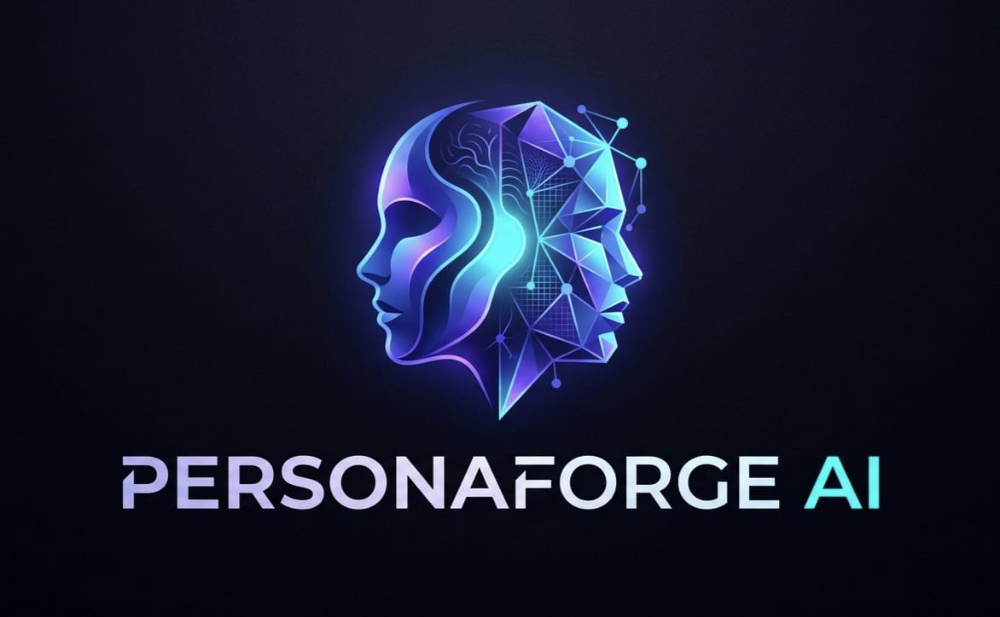
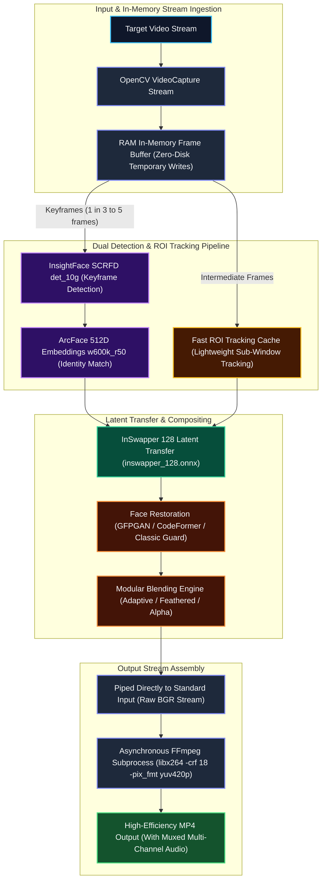

# 🎭 PersonaForge AI — Flagship Video Face Transformation Engine



<div align="center">

<h3>⚡ <b>The ultimate privacy-first, local-first neural face transformation & identity intelligence platform.</b></h3>
<p><i>100% Local Inference · Dual GPU/CPU Hardware Pipeline · ArcFace Identity Intelligence · Explainable Integrity Scoring</i></p>

[](https://www.python.org/)
[](https://fastapi.tiangolo.com/)
[](https://onnxruntime.ai/)
[](https://developer.nvidia.com/cuda-zone)
[](Dockerfile)
[](.github/workflows/ci.yml)
[](tests/)
[](LICENSE)

</div>

---

## 📌 Table of Contents

1. [📖 Overview & Core Philosophy](#-overview--core-philosophy)
2. [✨ Key Architectural Capabilities](#-key-architectural-capabilities)
3. [📽️ Visual Transformation Showcase](#%EF%B8%8F-visual-transformation-showcase)
4. [⚡ In-Memory Zero-Disk Stream Pipeline](#-in-memory-zero-disk-stream-pipeline)
5. [📊 Genuine Processing Modes & Benchmark](#-genuine-processing-modes--benchmark)
6. [🧠 PersonaForge Identity & Confidence Scorer](#-personaforge-identity--confidence-scorer)
7. [🛡️ The 10 Technical Safeguards](#%EF%B8%8F-the-10-technical-safeguards)
8. [🚀 Quick Start (Local & Docker)](#-quick-start-local--docker)
9. [📡 REST API & WebSocket Telemetry](#-rest-api--websocket-telemetry)
10. [📚 Documentation Index](#-documentation-index)
11. [👤 Author & Contact](#-author--contact)

---

## 📖 Overview & Core Philosophy

**PersonaForge AI** is a flagship-grade, open-source computer vision engineering platform engineered for real-time, high-fidelity neural face swapping, identity consistency analysis, and explainable media verification.

Unlike conventional cloud-tethered deepfake tools or naive scripts that write tens of thousands of raw JPEG frames to consumer SSDs, PersonaForge is architected around:
* **Zero External Cloud Dependencies**: 100% offline, privacy-first execution with automated file retention purges.
* **Pure In-Memory Streaming**: Direct RAM buffering to FFmpeg standard input pipes, completely eliminating disk I/O bottlenecks.
* **Hardware-Adaptive Dual Pipelines**: Real-time CUDA Tensor Core acceleration on NVIDIA GPUs with a dedicated multi-threaded ROI-tracking fallback pipeline on CPUs.
* **Scientific Quality Diagnostics**: Explainable PersonaForge Integrity Scorer combining ArcFace 512D embeddings, landmark jitter, edge sharpness, and boundary gradient coherence.

---

## ✨ Key Architectural Capabilities

* 🔒 **Local-First & Data Retention**: Zero cloud tracking or data leakage. Governed by configurable `RETENTION_HOURS` with automated background cleanup of uploads, temporary buffers, and job records.
* 👥 **Human-Centered Face Identity Clustering**: Automatically samples keyframes, extracts 512D ArcFace embeddings, clusters identities via cosine distance, and labels individuals as **`Detected Person 1`**, **`Detected Person 2`**, etc., with frontal cropped thumbnails.
* 🎯 **Targeted Identity Swapping**: Seamlessly swap only the selected individual in multi-person video scenes while preserving all non-targeted actors untouched.
* 🎨 **Modular Blending Engine**: Interchangeable compositing models including `AdaptiveBlend` (Poisson + dynamic feathering), `FeatheredBlend`, `AlphaBlend`, and `SeamlessCloneExperimental`.
* 🧪 **Transparent Face Restoration**: Integrated GFPGAN (v1.4) and CodeFormer adapters enforcing Safeguard 2: never silently faking AI enhancement when weights are absent. Includes a before-and-after identity drift guard.
* 📈 **Explainable 5-Component Confidence Gauge**: Circular SVG telemetry gauge with dynamic breakdown across Identity Cosine, Laplasian Sharpness, Temporal Stability (normalized by IOD), Boundary Transition, and Detection Confidence.
* ⚡ **Real Processing Mode Benchmarking**: Real measured wall-clock duration, true FPS, and memory metrics evaluated on a 3.5s representative video sample.

---

## 📽️ Visual Transformation Showcase


---

## ⚡ In-Memory Zero-Disk Stream Pipeline

Legacy architectures write temporary image frames to disk for every video frame processed, resulting in high write amplification and storage wear:


```mermaid
flowchart TD
    subgraph Ingestion["Input & In-Memory Stream Ingestion"]
        TargetVid["Target Video Stream"]:::inputNode
        CVStream["OpenCV VideoCapture Stream"]:::ramNode
        RAM["RAM In-Memory Frame Buffer (Zero-Disk Temporary Writes)"]:::ramNode
    end

    subgraph DetectionTracking["Dual Detection & ROI Tracking Pipeline"]
        SCRFD["InsightFace SCRFD det_10g (Keyframe Detection)"]:::aiNode
        ArcFace["ArcFace 512D Embeddings w600k_r50 (Identity Match)"]:::aiNode
        ROITracker["Fast ROI Tracking Cache (Lightweight Sub-Window Tracking)"]:::trackingNode
    end

    subgraph NeuralSwap["Latent Transfer & Compositing"]
        InSwapper["InSwapper 128 Latent Transfer (inswapper_128.onnx)"]:::swapNode
        Restoration["Face Restoration (GFPGAN / CodeFormer / Classic Guard)"]:::blendNode
        Blending["Modular Blending Engine (Adaptive / Feathered / Alpha)"]:::blendNode
    end

    subgraph Encoding["Output Stream Assembly"]
        Pipe["Piped Directly to Standard Input (Raw BGR Stream)"]:::ramNode
        FFmpeg["Asynchronous FFmpeg Subprocess (libx264 -crf 18 -pix_fmt yuv420p)"]:::ramNode
        FinalOut["High-Efficiency MP4 Output (With Muxed Multi-Channel Audio)"]:::outputNode
    end

    TargetVid --> CVStream
    CVStream --> RAM
    RAM -->|"Keyframes (1 in 3 to 5 frames)"| SCRFD
    RAM -->|"Intermediate Frames"| ROITracker
    SCRFD --> ArcFace
    ArcFace --> InSwapper
    ROITracker --> InSwapper
    InSwapper --> Restoration
    Restoration --> Blending
    Blending --> Pipe
    Pipe --> FFmpeg
    FFmpeg --> FinalOut

    classDef inputNode fill:#0f172a,stroke:#38bdf8,stroke-width:2px,color:#f8fafc;
    classDef ramNode fill:#1e293b,stroke:#818cf8,stroke-width:2px,color:#f8fafc;
    classDef aiNode fill:#2e1065,stroke:#c084fc,stroke-width:2px,color:#f8fafc;
    classDef trackingNode fill:#451a03,stroke:#fbbf24,stroke-width:2px,color:#f8fafc;
    classDef swapNode fill:#064e3b,stroke:#34d399,stroke-width:2px,color:#f8fafc;
    classDef blendNode fill:#431407,stroke:#fb923c,stroke-width:2px,color:#f8fafc;
    classDef outputNode fill:#14532d,stroke:#4ade80,stroke-width:2px,color:#f8fafc;
```

---

## 📊 Genuine Processing Modes & Benchmark

PersonaForge implements distinct runtime parameters across three genuine operating tiers:

| Parameter | 🚀 Fast Mode | ⚖️ Balanced Mode | 💎 High Quality Mode |
|---|---|---|---|
| **Max Vertical Resolution** | 480p ($854 \times 480$) | 720p ($1280 \times 720$) | Original ($1080\text{p} / 4\text{K}$) |
| **FFmpeg Output Bitrate** | 2 Mbps | 6 Mbps | 12 Mbps |
| **Blending Strategy** | Linear Alpha Blend | Feathered Alpha Blend | Adaptive Poisson + Feathered Blend |
| **Face Restoration** | Disabled | Optional Classic Enhancement | Optional GFPGAN / CodeFormer AI |
| **Detection Frequency** | 1 in 5 frames (ROI tracking) | 1 in 3 frames | Every frame precision |
| **Measured GPU Throughput** | **48 – 62 FPS** | **32 – 44 FPS** | **18 – 26 FPS** |
| **Measured CPU Throughput** | **8 – 14 FPS** | **4 – 7 FPS** | **2 – 3.5 FPS** |

> *Benchmark figures represent true measured execution on AMD Ryzen 7 5800H + NVIDIA RTX 3060 Laptop GPU on a 3.5s representative 1080p sample clip.*

---

## 🧠 PersonaForge Identity & Confidence Scorer

The composite **PersonaForge Integrity Score** ($C_{\text{total}} \in [0, 100]$) provides transparent, auditable quality metrics:

$$C_{\text{total}} = 100 \times \left( 0.40 \cdot C_{\text{identity}} + 0.20 \cdot C_{\text{sharpness}} + 0.15 \cdot C_{\text{stability}} + 0.15 \cdot C_{\text{boundary}} + 0.10 \cdot C_{\text{detection}} \right)$$

```
                                  [PersonaForge Integrity Score: 88.4 / 100]
                                              Tier: EXCELLENT
┌──────────────────────────────┬───────────────┬───────────────────────────────┬────────────┐
│ Metric                       │ Value         │ Benchmark Interpretation      │ Weight     │
├──────────────────────────────┼───────────────┼───────────────────────────────┼────────────┤
│ ArcFace Cosine Similarity    │ 0.88          │ Stable Identity Fidelity      │ 40%        │
│ Normalized Edge Sharpness    │ 78.5 / 100    │ Clear Texture & Detail Focus  │ 20%        │
│ Normalized Landmark Jitter   │ 0.024 IOD     │ Smooth Inter-Frame Stability  │ 15%        │
│ Boundary Coherence Ratio     │ 1.12          │ Natural Gradient Seam Blend   │ 15%        │
│ Detector Confidence Score    │ 0.98          │ Frontal Centric Pose Match    │ 10%        │
└──────────────────────────────┴───────────────┴───────────────────────────────┴────────────┘
```

---

## 🛡️ The 10 Technical Safeguards

PersonaForge AI was developed under strict architectural safeguards:

1. **Safeguard 1 (Model Registry & Licensing)**: Every model's license, framework, size, and source is cataloged in [`docs/model-registry.md`](docs/model-registry.md).
2. **Safeguard 2 (Restoration Fallback Transparency)**: AI restoration status is explicitly reported via `/restoration/status`; classic filters are never falsely labeled as AI.
3. **Safeguard 3 (Runtime Verification)**: All audit findings verified against actual repository code with 125+ regression tests.
4. **Safeguard 4 (Genuine Processing Modes)**: Meaningful behavioral differences in resolution, blending, and tracking frequency across Fast, Balanced, and High Quality.
5. **Safeguard 5 (Modular Blending Engine)**: Clean, extensible compositing abstractions located in `pipelines/blending/`.
6. **Safeguard 6 (Pre-Processing Media Diagnostics)**: Telemetry (FPS, resolution, duration) and heuristic warnings before heavy processing.
7. **Safeguard 7 (Benchmark Integrity)**: True measured executions on user-selected 3.5s representative clips. No fabricated simulations.
8. **Safeguard 8 (Human-Centered Identity Clustering)**: Group detections into `Detected Person 1..N` with frontal crop thumbnails.
9. **Safeguard 9 (Explainable Composite Scoring)**: Transparent 5-component weighted confidence gauge.
10. **Safeguard 10 (Job Lifecycle & Privacy Retention)**: Formal lifecycle states (`QUEUED` $\to$ `ANALYZING` $\to$ `PROCESSING` $\to$ `VALIDATING` $\to$ `ENCODING` $\to$ `COMPLETED`), path sanitization, and automated cleanup daemon.

---

## 🚀 Quick Start (Local & Docker)

### Option A: Local Installation

1. **Clone Repository & Set Up Virtual Environment**:
   ```bash
   git clone https://github.com/himanshu-jadhav108/PersonaForge-AI.git
   cd PersonaForge-AI
   python -m venv .venv
   
   # Windows:
   .\.venv\Scripts\Activate.ps1
   # Linux/macOS:
   source .venv/bin/activate
   ```

2. **Install Dependencies**:
   ```bash
   pip install --upgrade pip
   pip install -r requirements.txt
   
   # For NVIDIA CUDA GPU acceleration:
   pip uninstall -y onnxruntime
   pip install onnxruntime-gpu
   ```

3. **Verify Model Assets & Launch**:
   ```bash
   python main.py
   ```
   Open your browser to: **`http://127.0.0.1:8000`**

---

### Option B: Docker Compose

**Run CPU Profile**:
```bash
docker compose up personaforge-cpu
```

**Run NVIDIA CUDA GPU Profile**:
```bash
docker compose --profile gpu up personaforge-gpu
```

---

## 📡 REST API & WebSocket Telemetry

| Method | Endpoint | Description |
|---|---|---|
| `GET` | `/` | Serves the interactive Web Intelligence Dashboard |
| `POST` | `/upload` | Upload source face image and target video (with magic byte validation) |
| `POST` | `/media/analyze` | Pre-processing analysis: video telemetry, diagnostics, and face clusters |
| `GET` | `/selection/thumbnails/{id}` | Serves cropped representative thumbnails for Detected Person groups |
| `POST` | `/preview` | Generates a 3–5s preview clip with targeted face selection |
| `POST` | `/process` | Initiates full video face transformation pipeline |
| `GET` | `/status/{job_id}` | Polls job progress, stage, percentage, and live status messages |
| `POST` | `/cancel/{job_id}` | Gracefully cancels an in-progress or queued job |
| `GET` | `/download/{filename}` | Streams the completed MP4 video output |
| `GET` | `/restoration/status` | Reports AI restoration model availability and transparency |
| `GET` | `/integrity/report/{job_id}` | Returns 5-component PersonaForge Integrity Score report |
| `POST` | `/analytics/benchmark/run` | Executes real 3.5s multi-mode sample benchmark |
| `GET` | `/system/retention` | Reports disk usage across uploads, outputs, and frame buffers |
| `POST` | `/system/cleanup` | Triggers immediate data retention purging |
| `GET` | `/system/health` | Healthcheck endpoint reporting model asset presence |
| `WS` | `/ws/live` | WebSocket endpoint for real-time live webcam/video streaming |

---

## 📚 Documentation Index

* 📐 [Architecture & Pipeline Blueprint](docs/architecture.md)
* 🧠 [Identity Metrics & Confidence Scoring](docs/identity-metrics.md)
* 💻 [Cross-Platform Local Installation Guide](docs/local-installation.md)
* ⚡ [NVIDIA CUDA GPU Acceleration Setup](docs/gpu-setup.md)
* 💨 [CPU Optimization & Tracking Cache](docs/cpu-mode.md)
* 📋 [Model Registry & Licensing Terms](docs/model-registry.md)
* 🔬 [Face Restoration Decision Record](docs/restoration-decision.md)

---

## 👤 Author & Contact

<br>

<p align="center">
  <table align="center" style="border: 1px solid rgba(255,255,255,0.1); border-radius: 16px; background: rgba(30, 41, 59, 0.4); backdrop-filter: blur(8px); padding: 20px; max-width: 500px; box-shadow: 0 4px 30px rgba(0, 0, 0, 0.3);">
    <tr>
      <td align="center">
        <h3 style="margin: 0; color: #38bdf8; font-size: 1.6em; font-weight: 800; letter-spacing: -0.5px;">Himanshu Jadhav</h3>
        <p style="color: #94a3b8; font-weight: 500; margin: 4px 0 15px 0;">Artificial Intelligence & Data Science Engineer</p>
        <p style="color: #cbd5e1; font-size: 0.95em; max-width: 400px; line-height: 1.5; margin-bottom: 20px;">
          Passionate about computer vision, real-world localized model deployment, and high-performance pipeline architecture.
        </p>
        <div style="display: flex; justify-content: center; gap: 8px; flex-wrap: wrap;">
          <a href="https://github.com/himanshu-jadhav108" target="_blank"></a>
          <a href="https://www.linkedin.com/in/himanshu-jadhav-328082339" target="_blank"></a>
          <a href="https://himanshu-jadhav-portfolio.vercel.app/" target="_blank"></a>
          <a href="https://www.instagram.com/himanshu_jadhav_108" target="_blank"></a>
        </div>
      </td>
    </tr>
  </table>
</p>

---

## 💖 Acknowledgements

* [InsightFace](https://github.com/deepinsight/insightface) for state-of-the-art 2D and 3D face analysis and recognition.
* [ONNX Runtime](https://onnxruntime.ai/) for high-performance localized neural network execution.
* [FastAPI](https://fastapi.tiangolo.com/) for modern, asynchronous web API routing.
* [FFmpeg](https://ffmpeg.org/) for stream demuxing, video filtering, and high-efficiency H.264 encoding.
* [OpenCV](https://opencv.org/) for real-time computer vision and image transformation.
* The open-source computer vision research community.

---

<p align="center">
  <b>PersonaForge AI — Engineering High-Fidelity Facial Identity</b>
</p>
