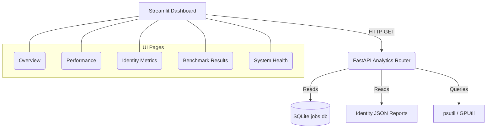

# Production Analytics Dashboard

The Production Analytics Dashboard provides real-time monitoring of system health, job performance, and identity consistency metrics for PersonaForge AI.

## Architecture

The analytics stack is built on a two-tier architecture:
1. **Backend (FastAPI)**: The `backend/app/analytics` module exposes metrics through REST endpoints. It aggregates data from the SQLite job database, reads local identity JSON reports, and uses `psutil` to monitor system health.
2. **Frontend (Streamlit)**: A multipage dashboard (`dashboard_app.py`) runs independently and fetches data from the FastAPI backend, rendering interactive Plotly charts in a professional dark-mode UI.



## Running the Dashboard

Ensure the main FastAPI application is running (`uvicorn main:app`).
In a separate terminal, launch the Streamlit interface:

```bash
streamlit run dashboard_app.py
```

The dashboard will automatically open in your default browser (typically at `http://localhost:8501`).

## Endpoints

- `GET /analytics/overview`: High-level aggregated statistics (total jobs, success rate, failed jobs).
- `GET /analytics/performance`: Recent job processing times and queue lengths.
- `GET /analytics/system`: Real-time system utilization (CPU, RAM, GPU).
- `GET /analytics/identity`: Historical identity scores parsed from output reports.
