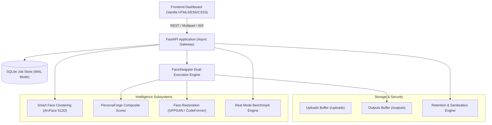

# PersonaForge AI — System Architecture & Pipeline Design

PersonaForge AI is an open-source, local-first neural face transformation and identity preservation platform built around high-throughput video streaming, deep facial embeddings, hardware-adaptive acceleration, and explainable quality diagnostics.

---

## 1. High-Level Architectural Topology



---

## 2. Core Pipelines: GPU vs. CPU Adaptive Execution

PersonaForge provides two distinct pipeline architectures optimized for heterogeneous hardware environments:

### A. GPU In-Memory Stream Pipeline (`pipeline_gpu.py` / `FaceSwapper`)
* **Execution Provider**: `CUDAExecutionProvider` / `TensorrtExecutionProvider` with fallback to `CPUExecutionProvider`.
* **Zero-Disk In-Memory Frame Flow**:
  1. Frames are read continuously via an OpenCV `VideoCapture` stream into memory buffers.
  2. InsightFace `det_10g` SCRFD detects target face candidates.
  3. ArcFace `w600k_r50` extracts 512-dimensional canonical identity vectors.
  4. If targeted identity mode is active, cosine similarity determines the specific target person to swap (`person_1`, `person_2`, etc.).
  5. `InSwapper 128` applies latent facial feature swap on aligned 128x128 crops.
  6. Modular blending (`AdaptiveBlend`, `FeatheredBlend`, or `AlphaBlend`) composites the swapped face back into the source resolution frame.
  7. Optional AI Face Restoration (`GFPGAN` / `CodeFormer` / `ClassicEnhancer`) enhances resolution while guarding against identity drift.
  8. Swapped frames are piped directly to an asynchronous FFmpeg child process via standard input (`stdin.write(frame.tobytes())`), eliminating temporary disk JPEG overhead.
  9. Multiplexes source audio track with H.264 video encoding in a final pass.

### B. CPU Multi-Threaded Tracking Pipeline (`pipelines/pipeline_cpu.py`)
* **Execution Provider**: `CPUExecutionProvider` with OpenMP multi-threading.
* **Intelligent ROI Face Tracking Cache**:
  * Instead of running full SCRFD face detection on every frame, SCRFD runs on keyframe intervals (e.g. every 5 frames in Fast mode or 3 frames in Balanced mode).
  * Intermediate frames utilize lightweight bounding-box and optical tracking on cached Regions of Interest (ROIs).
* **Dynamic Resolution Downscaling**:
  * Downscales target video to max 720p on CPU to preserve interactive frame rates.
* **Shared Blending**: Utilizes the identical modular blending architecture for visual consistency with the GPU pipeline.

---

## 3. The 10 Technical Safeguards Implementation

| Safeguard | Requirement | Implementation in PersonaForge |
|---|---|---|
| **Safeguard 1** | Model Registry & Licensing Record | Documented in `docs/model-registry.md` with upstream licenses and terms. |
| **Safeguard 2** | Restoration Fallback Transparency | `RestorationFactory` reports AI availability explicitly; no silent fallback masquerading as AI. |
| **Safeguard 3** | Runtime Verification | All 18 Phase 0 audit findings verified with regression tests. |
| **Safeguard 4** | Genuine Processing Modes | Distinct resolutions, tracking frequencies, blending models, and bitrates across Fast, Balanced, and High Quality. |
| **Safeguard 5** | Modular Blending Engine | Package `pipelines/blending/` with `AlphaBlend`, `FeatheredBlend`, `AdaptiveBlend`, and `SeamlessCloneExperimental`. |
| **Safeguard 6** | Pre-Processing Diagnostics | `SmartFaceSelector.analyze_media()` extracts FPS, resolution, orientation, and flags low light/resolution warnings. |
| **Safeguard 7** | Benchmark Integrity | `ModeBenchmarkEngine` runs non-simulated real evaluations on a 3.5s representative sample segment. |
| **Safeguard 8** | Human-Centered Identity Clustering | ArcFace 512D cosine clustering labels individuals as `Detected Person 1..N` with representative thumbnails. |
| **Safeguard 9** | Explainable Composite Scoring | `PersonaForgeIntegrityScorer` calculates weighted confidence across identity, sharpness, temporal stability, boundary coherence, and detection confidence. |
| **Safeguard 10** | Job Lifecycle & Privacy Retention | Formal 6-stage lifecycle (`QUEUED` $\to$ `ANALYZING` $\to$ `PROCESSING` $\to$ `VALIDATING` $\to$ `ENCODING` $\to$ `COMPLETED`), path sanitization, and `RetentionManager` auto-purging. |

---

## 4. In-Memory Streaming Architecture

Legacy face-swapping implementations write thousands of individual JPEG image files to disk before invoking FFmpeg, creating severe SSD wear and heavy I/O bottlenecks.

```
[Input Video] 
      │ (OpenCV VideoCapture stream)
      ▼
 [RAM Buffer] ──► [InsightFace Detect & Align] ──► [InSwapper 128 Latent Swap]
      │                                                     │
      │                                                     ▼
      │                                           [Modular Blending & Restoration]
      │                                                     │
      ▼                                                     ▼
[Raw BGR Stream (stdin pipe)] ──────────────────────────────┘
      │
      ▼
[FFmpeg Process (libx264 -crf -preset -pix_fmt yuv420p)]
      │
      ▼
[Output MP4 Stream]
```

---

## 5. Security & Data Retention Architecture

* **Strict Session Identifiers**: Path traversal prevention via regex validation (`^[a-f0-9]{32}$` or standard hyphenated UUIDs).
* **Binary Magic Byte Inspection**: File headers are validated against JPEG, PNG, WEBP, MP4, MOV, MKV, and AVI byte signatures.
* **Filename Sanitization**: Path components, directory delimiters, and non-whitelisted characters are stripped.
* **Automated Retention Engine**: `RetentionManager` purges expired uploads, outputs, and intermediate scratch files based on `RETENTION_HOURS` (default 24h).
